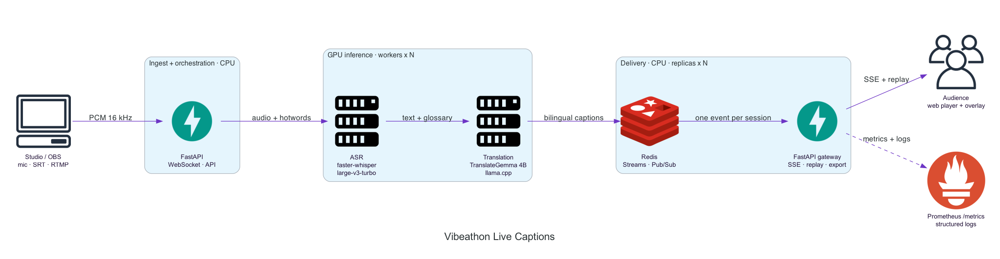

# Cómo diseñé la arquitectura de streaming

## Principio central

Separé el transporte de la señal, la inferencia por escenario y la distribución
a la audiencia. Para mí, el recurso costoso es cada escenario activo: agregar un
espectador no debe volver a ejecutar ASR ni traducción.

| Tramo | Opción que elegí | Motivo |
|---|---|---|
| Fuente de navegador | WebSocket binario | Necesito enviar audio continuo y mensajes de control |
| Fuente de producción | SRT/RTMP hacia media ingress | OBS y vMix los soportan de forma nativa |
| Simulación | FFmpeg `-re` | Reproduzco un archivo con el reloj de una señal real |
| Player del laboratorio | HLS de baja latencia | Conserva H.264 + AAC sin otra transcodificación |
| Historial corto | Redis Streams | Obtengo orden, IDs y replay acotado |
| Fan-out entre réplicas | Redis Pub/Sub | Entrego una vez por sesión y réplica |
| Fan-out dentro de réplica | Colas `asyncio` acotadas | No multiplico conexiones Redis por espectador |
| Audiencia | SSE | Necesito flujo unidireccional, reconexión y `Last-Event-ID` |
| Video de producción | Media server/CDN | FastAPI no debe transportar video |

## Cómo conecto una señal real

OBS o vMix publican SRT/RTMP en el media server. Desde allí mantengo dos salidas:

1. entrego video y audio a la audiencia mediante HLS o WebRTC;
2. leo una copia de la señal con FFmpeg, descarto video y genero PCM mono de
   16 kHz para el WebSocket de captions.

Incluí `scripts/media_stream_bridge.py` como adaptador reiniciable. El servicio
principal no conoce MediaMTX, OBS ni vMix; solamente conoce su contrato PCM. Así
puedo cambiar de media server sin tocar ASR, traducción ni fan-out.

En el laboratorio uso HLS porque RTMP transporta AAC y MediaMTX lo conserva sin
transcodificar. WebRTC no transporta AAC en este flujo: para usarlo con audio
agregaría una conversión a Opus. Elegí documentar esa decisión en lugar de
mostrar un player WebRTC sin sonido.

## Por qué uso WebSocket para entrada y SSE para salida

En la entrada necesito audio binario continuo, detección de desconexión y un
mensaje explícito de cierre. WebSocket cubre las tres necesidades con una sola
conexión.

En la salida el navegador sólo recibe eventos. SSE es más simple, atraviesa
proxies HTTP habituales y EventSource reconecta con `Last-Event-ID`. No necesito
un WebSocket por espectador para un canal unidireccional.

## Cómo trato pausa y directo

Cuando el player se pausa envío `caption-control: pause` al overlay. Congelo el
texto visible y descarto nuevos eventos en esa vista; el backend sigue procesando
porque otros espectadores continúan en vivo.

Al reanudar llevo el video a `liveSyncPosition`, limpio la cola local y envío
`caption-control: resume-live`. No intento reproducir captions acumulados sobre
imágenes actuales. Si el producto necesitara DVR, guardaría video y captions con
una línea de tiempo compartida; no mezclaría esa semántica con el modo en vivo.

## Escenarios que revisé

### Un escenario, pocos espectadores

Una réplica de aplicación y una GPU alcanzan. Aun así mantengo Redis porque me
permite demostrar reconexión y conservar el mismo diseño cuando agrego réplicas.

### Cinco a diez escenarios simultáneos

Cada fuente tiene `session_id`, buffer, contexto y secuencia independientes.
Distribuyo los pedidos sobre el pool GPU. La batería envía audio a 2, 5 y 10
fuentes en paralelo y exige la primera leyenda en menos de cinco segundos.

### Muchos espectadores en una charla

Produzco el caption una vez, lo publico una vez y lo entrego a todos los gateways
interesados. Original y traducción viajan en el mismo evento; cambiar CC es una
operación local del navegador.

Cada réplica abre una suscripción Pub/Sub por sesión y reparte el evento a colas
locales acotadas. Si un cliente es lento, descarto primero su caption más antiguo
sin frenar el stream ni al resto de la audiencia.

### Corte y reconexión

Redis Streams asigna un ID a cada caption. Cuando EventSource reconecta, uso
`Last-Event-ID` para reproducir los eventos posteriores antes de volver a
Pub/Sub. Limito el historial a los últimos 2.000 eventos por sesión.

### Archivo final y auditoría

Genero SRT, VTT o texto desde eventos finales mediante
`GET /api/sessions/{id}/transcript/{format}?language=...`. Si necesitara
retención de varios eventos, reprocessing, data lake o consumidores externos,
agregaría Kafka para eventos finales; no lo pondría entre PCM y captions.

## Cómo lo llevaría a Kubernetes y KubeRay

Mantendría unidades independientes:

- `caption-gateway`: FastAPI/SSE, CPU y réplicas horizontales;
- `redis`: servicio administrado o StatefulSet persistente;
- `asr-workers`: GPU y capacidad caliente por escenarios activos;
- `translation-workers`: GPU, batching y réplica independiente;
- `media-ingress`: SRT/RTMP/HLS/WebRTC fuera del camino de inferencia.

Usaría KubeRay/Ray Serve cuando el evento opere varias GPU o tipos de acelerador
y necesite scheduling, colas y autoscaling coordinado. No lo usaría para
reemplazar el media ingress, el registro de sesiones ni el fan-out SSE. Para el
MVP, los servicios HTTP reducen riesgo y ya demostraron diez sesiones sobre una
RTX 3090.

## Gates que exigiría en producción

- latencia p95 desde audio hasta caption SSE;
- aislamiento entre sesiones;
- una inferencia por evento aunque aumenten los espectadores;
- backpressure por escenario y memoria acotada;
- reconexión SSE sin perder captions confirmados;
- pausa/reanudación sin desincronizar video y texto;
- health checks separados para broker, ASR y traducción;
- capacidad GPU precalentada para el máximo de escenarios;
- autenticación y límites de carga en WebSocket e inyección externa.

## Resultado de fan-out local

Publiqué un caption sintético y comprobé que todos los clientes recibieran el
mismo `event_id`:

| Réplica FastAPI | Viewers | Entregados | p95 | p99 |
|---:|---:|---:|---:|---:|
| 1 | 1.000 | 1.000 | 173 ms | 176 ms |
| 1 | 5.000 | 5.000 | 1,316 s | 1,358 s |

La cola de un proceso se vuelve visible con 5.000 conexiones. Mi punto de
partida sería un HPA de gateways con unas 1.000 conexiones SSE por réplica y
workers GPU separados. Repetiría la prueba detrás del ingress real porque los
límites de archivos, red y proxy cambian el resultado.
